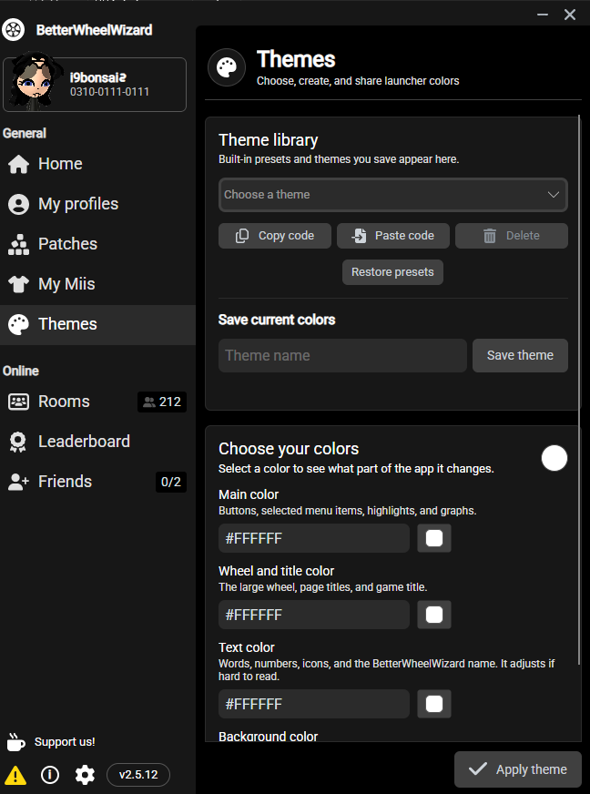
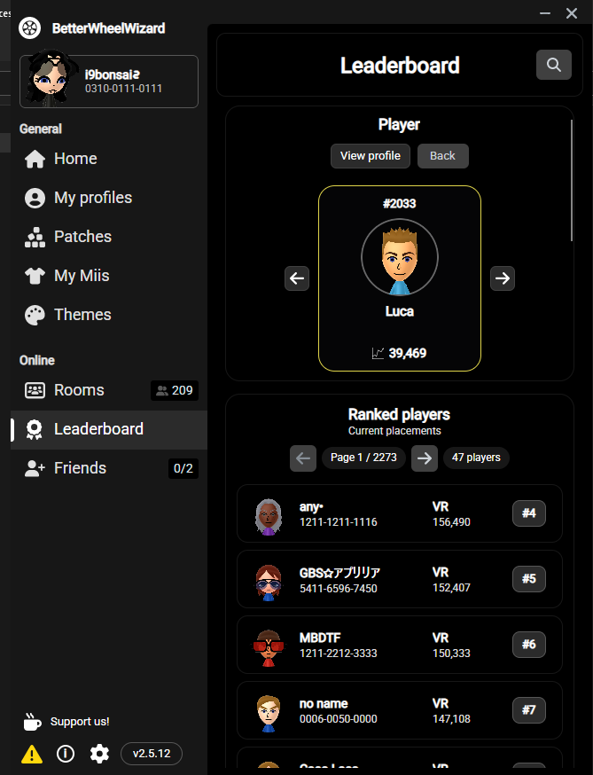

# BetterWheelWizard

<p align="center">
  <strong>A polished community launcher for Mario Kart Wii and Retro Rewind.</strong><br />
  Launch the game, browse rooms, search RWFC data, manage Miis, customize the UI, and keep your data backed up.
</p>

<p align="center">
  <a href="https://github.com/imlucaa/BetterWheelWizard/releases/latest">
    
  </a>
  <a href="https://github.com/imlucaa/BetterWheelWizard/releases">
    
  </a>
  <a href="LICENSE">
    
  </a>
</p>

<p align="center">
  <a href="https://github.com/imlucaa/BetterWheelWizard/releases/latest"><strong>Download</strong></a>
  ·
  <a href="#features"><strong>Features</strong></a>
  ·
  <a href="#setup"><strong>Setup</strong></a>
  ·
  <a href="#requirements"><strong>Requirements</strong></a>
  ·
  <a href="CHANGELOG.md"><strong>Changelog</strong></a>
  ·
  <a href="https://github.com/imlucaa/BetterWheelWizard/issues/new"><strong>Report a bug</strong></a>
</p>

> [!IMPORTANT]
> BetterWheelWizard is an unofficial community fork of
> [TeamWheelWizard/WheelWizard](https://github.com/TeamWheelWizard/WheelWizard).
> It is not an official Team Wheel Wizard release.

## Download

Get the newest build from the
**[latest BetterWheelWizard release](https://github.com/imlucaa/BetterWheelWizard/releases/latest)**.

| Platform | Release file |
| --- | --- |
| Windows x64 | `BetterWheelWizardWindows.exe` |
| Linux x64 | `BetterWheelWizard_Linux` |
| Linux ARM64 | `BetterWheelWizard_ARM64_Linux` |

> [!NOTE]
> macOS packages are currently unavailable because signed builds could not be
> produced. Windows and Linux builds are available normally.

## Features

### Play and manage

- Launch Retro Rewind through Dolphin or use WiiCompiled
- Search the RWFC leaderboard by friend code or player/Mii name
- Browse duplicate leaderboard search results with previous/next match controls
- Browse live rooms with popup search, average-VR filters, sorting, race
  status, and detailed player information
- Find public Miis through RWFC friend-code lookup and import them directly
- Search, import, copy, and manage saved Miis

### Make it yours

- Choose from a larger collection of built-in color themes or save your own
- Customize main, wheel/title, text, and background colors with a visual picker or editable HEX fields
- Import and share compact `BWW1` theme codes
- Use the full color range while automatic contrast adjustments keep text readable

### Protect your data

- Back up every detected regional `rksys.dat` save while preserving folders
  such as `RMCE` and `RMCP`
- Back up `RRRating.pul` independently to a destination you choose
- Copy files directly without changing the originals or creating ZIP archives

## Setup

### Dolphin / Retro Rewind

1. Download the latest BetterWheelWizard release.
2. Open the app and point it at your Dolphin executable.
3. Select your legally dumped Mario Kart Wii game file.
4. Let BetterWheelWizard install or update Retro Rewind into the WheelWizard-managed folder.
5. Launch Retro Rewind from the app.

BetterWheelWizard manages the expected Retro Rewind folder structure for you and keeps all major tools in one place, including Miis, rooms, leaderboard access, themes, and backups.

### What the app helps with after setup

Once everything is configured, BetterWheelWizard gives you quick access to the parts of Retro Rewind and RWFC that people usually bounce between separate tools for:

- launching and maintaining your main play setup
- browsing active rooms and checking player details
- searching the leaderboard and opening player profiles
- importing Miis from RWFC into your local collection
- saving and switching launcher themes
- backing up important files before making changes

### WiiCompiled

1. Install WiiCompiled from the Settings pages inside BetterWheelWizard.
2. Use a supported PAL Mario Kart Wii dump for WiiCompiled mode.
3. If you also use Retro Rewind, BetterWheelWizard can hand Retro Rewind data into the WiiCompiled flow and track whether recomp products need repair.

> [!NOTE]
> Dolphin + Retro Rewind supports any game region, while WiiCompiled currently requires a PAL dump.

## Feature showcase

The screenshots below show the current BetterWheelWizard interface and focus on the parts of the app most people use day to day.

### Theme library and sharing

Build a launcher style from four easy-to-understand color controls, choose colors visually or paste exact HEX values, and save the result to your library. Built-in presets cover basic rainbow colors and popular colors such as coral, mint, lavender, and rose. You can also copy or paste a compact `BWW1` code to share a complete theme.

<p align="center">
  <a href="docs/screenshots/themes.png">
    
  </a>
</p>

<p align="center">
  <a href="docs/screenshots/theme-color.png">
    
  </a>
</p>

### Mii Downloader

Look up an RWFC player by friend code or by name, browse duplicate search matches, preview the result, and download a fresh copy directly into My Miis. You can also explore random public Miis from Discover Miis without leaving the page.

<p align="center">
  <a href="docs/screenshots/mii-downloader.png">
    
  </a>
</p>

- Search by RWFC friend code or player name
- Browse multiple matches with the built-in left/right controls
- Preview a Mii before copying it into your local collection
- Keep My Miis and online discovery in one place

### Better room browsing

Search rooms and players, filter by average VR, and sort live results from one compact popup-driven control panel. Room and player details stay readable at a glance, while the page keeps a simpler native layout with less wasted space.

<p align="center">
  <a href="docs/screenshots/better-rooms.png">
    
  </a>
</p>

- Popup actions keep the header clean instead of leaving filters permanently open
- Sorting and VR filtering are easier to reach without cluttering the page
- Denser room cards make live information easier to scan quickly

### Leaderboard search and player lookup

Search the live RWFC leaderboard by friend code or player name, browse duplicate matches with previous and next controls, and jump straight into a player profile when needed. The leaderboard keeps the native app styling while making search results much easier to inspect.

<p align="center">
  <a href="docs/screenshots/better-leaderboard.png">
    
  </a>
</p>

- Search by either full friend code or player/Mii name
- Step through duplicate name matches without re-running the search
- Open the matched player profile directly from the result card
- Fall back to the normal ranked leaderboard view when the search is cleared

<p align="center"><sub>Click a screenshot to open it at full resolution.</sub></p>

## Requirements

You must provide your own legally dumped Mario Kart Wii game backup.

Supported formats: `.iso`, `.gcm`, `.gcz`, `.ciso`, `.wbfs`, `.wia`, and
`.rvz`.

| Launch mode | Supported game region |
| --- | --- |
| Retro Rewind through Dolphin | Any region |
| WiiCompiled, with or without Retro Rewind | PAL |

## Notes

- BetterWheelWizard is designed around a native dark interface and popup-driven actions instead of keeping every search or filter box permanently on screen.
- Some features depend on RWFC availability, including live leaderboard queries, public Mii search, and room data.
- BetterWheelWizard itself does not replace the need for your own Dolphin setup or legally dumped game files.
- Screenshot examples in this README reflect the current BetterWheelWizard interface and may change slightly between releases as the UI is refined.

## Release highlights

- Cleaner native dark styling across key pages
- Popup-based search and actions for rooms, leaderboard lookup, and Mii workflows
- Improved RWFC integration for leaderboard and Mii searches
- Duplicate-result browsing for both leaderboard lookups and Mii downloads
- Better spacing, reduced UI clutter, and cleaner window chrome

## Build from source

BetterWheelWizard targets **.NET 10**. From the repository root:

```powershell
dotnet test WheelWizard.sln --configuration Release

dotnet publish WheelWizard/WheelWizard.csproj `
  --configuration Release `
  --runtime win-x64 `
  --self-contained true `
  -p:PublishSingleFile=true `
  -p:IncludeNativeLibrariesForSelfExtract=true `
  -p:EnableCompressionInSingleFile=true
```

Change `win-x64` to `linux-x64` or `linux-arm64` when publishing for Linux.

## Report a bug

[Open an issue](https://github.com/imlucaa/BetterWheelWizard/issues/new) and
include:

- What happened and what you expected instead
- Steps to reproduce the problem
- Your operating system and launch mode
- A screenshot or log, when available

## Credits

BetterWheelWizard is based on
[TeamWheelWizard/WheelWizard](https://github.com/TeamWheelWizard/WheelWizard),
created by [Patchzy](https://github.com/patchzyy) and
[WantToBeeMe](https://github.com/wanttobeeme).

- Retro Rewind was created by ZPL. See the
  [Tockdom Wiki](https://wiki.tockdom.com/wiki/Retro_Rewind).
- Parts of the Mii renderer were inspired by
  [ariankordi/FFL-Testing](https://github.com/ariankordi/FFL-Testing), based on
  [aboood40091/FFL-Testing](https://github.com/aboood40091/FFL-Testing).
- The wheel and flat-tire icons are by Delapouite from
  [Game Icons](https://game-icons.net/about.html).
- Special icons use Chadderz' Terrible Mario Kart Font.

## License

BetterWheelWizard is distributed under the
[GNU General Public License v3.0](LICENSE), matching the upstream project.
You may use, modify, and redistribute it under the terms of that license.
Derivative distributions must remain GPL v3.0 compatible and provide their
corresponding source code.
