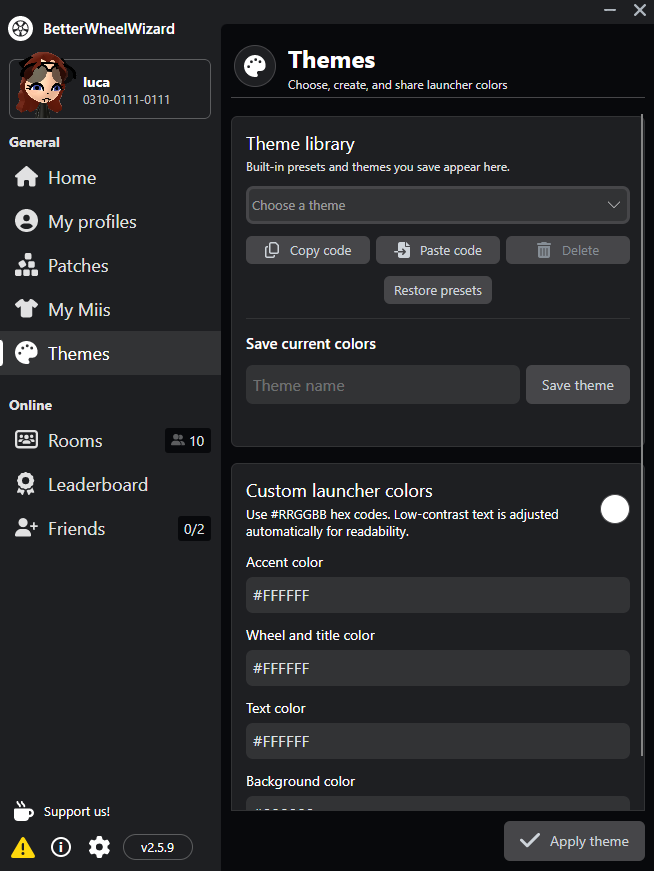
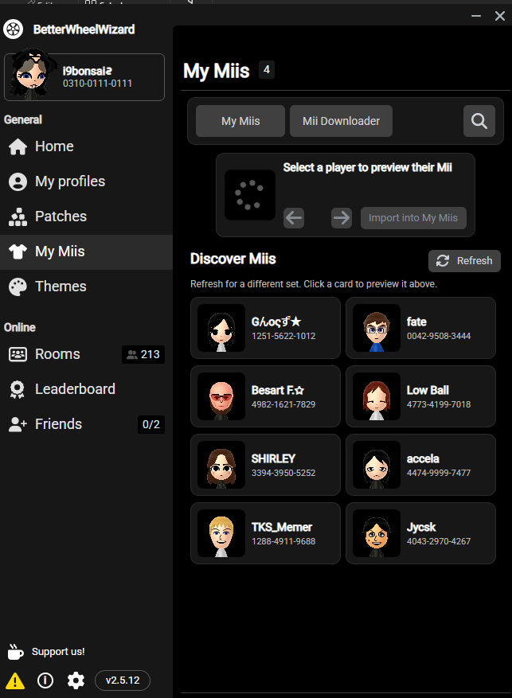
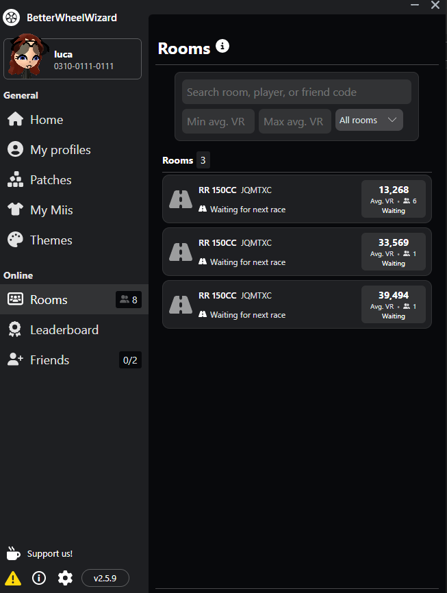

# BetterWheelWizard

<p align="center">
  <strong>An enhanced Wheel Wizard launcher for Mario Kart Wii and Retro Rewind.</strong>
</p>

<p align="center">
  <a href="https://github.com/imlucaa/BetterWheelWizard/releases/latest">
    
  </a>
  <a href="https://github.com/imlucaa/BetterWheelWizard/releases">
    
  </a>
  <a href="LICENSE">
    
  </a>
</p>

> [!IMPORTANT]
> BetterWheelWizard is an unofficial community fork of
> [TeamWheelWizard/WheelWizard](https://github.com/TeamWheelWizard/WheelWizard).
> It is not an official Team Wheel Wizard release.

## Highlights

- Enhanced room browser with search, VR filters, sorting, room details, and race status
- Mii Downloader with RWFC friend-code lookup and downloadable public Miis
- Saved-Mii search, importing, copying, and player Mii actions
- Theme library with built-in presets, saved themes, and compact sharing codes
- Direct backups for regional `rksys.dat` saves and `RRRating.pul`
- Dolphin and WiiCompiled support

## Feature showcase

### Import and share theme codes

Choose a built-in preset or save your own accent, branding, text, and
background colors. Import shared themes by pasting a compact `BWW1` code, or
copy your current colors as a code to share with others. Automatic contrast
adjustments keep launcher text readable.

<p align="center">
  <a href="docs/screenshots/better-themes.png">
    
  </a>
</p>

### Mii Downloader

Find an RWFC player by friend code or browse random public Miis, then import a
fresh copy into My Miis.

<p align="center">
  <a href="docs/screenshots/mii-downloader.png">
    
  </a>
</p>

### Better room browsing

Search rooms and players, filter by average VR, and sort the room list from one
compact control panel.

<p align="center">
  <a href="docs/screenshots/better-rooms-2.5.10.png">
    
  </a>
</p>

<p align="center"><sub>Click any screenshot to view it at full resolution.</sub></p>

## Download

Download **BetterWheelWizard.exe** from the
[latest release](https://github.com/imlucaa/BetterWheelWizard/releases/latest).


## Requirements

You must provide your own legally dumped Mario Kart Wii game backup.
Supported formats include `.iso`, `.gcm`, `.gcz`, `.ciso`, `.wbfs`, `.wia`,
and `.rvz`.

| Mode | Supported game region |
| --- | --- |
| Retro Rewind through Dolphin | Any region |
| WiiCompiled, with or without Retro Rewind | PAL |

## Build from source

The project currently targets .NET 10.

```powershell
dotnet test WheelWizard.sln --configuration Release

dotnet publish WheelWizard/WheelWizard.csproj `
  --configuration Release `
  --runtime win-x64 `
  --self-contained true `
  -p:PublishSingleFile=true `
  -p:IncludeNativeLibrariesForSelfExtract=true
```

## Report a bug

[Open an issue](https://github.com/imlucaa/BetterWheelWizard/issues/new) and
include:

- What happened
- Steps to reproduce it
- Your Windows version and launch mode
- A screenshot or log when available

## Credits

BetterWheelWizard is based on
[TeamWheelWizard/WheelWizard](https://github.com/TeamWheelWizard/WheelWizard),
created by [Patchzy](https://github.com/patchzyy) and
[WantToBeeMe](https://github.com/wanttobeeme).

Additional upstream acknowledgements:

- Retro Rewind was created by ZPL. See the
  [Tockdom Wiki](https://wiki.tockdom.com/wiki/Retro_Rewind).
- Parts of the Mii renderer were inspired by
  [ariankordi/FFL-Testing](https://github.com/ariankordi/FFL-Testing), based on
  [aboood40091/FFL-Testing](https://github.com/aboood40091/FFL-Testing).
- The wheel and flat-tire icons are by Delapouite from
  [Game Icons](https://game-icons.net/about.html).
- Special icons use Chadderz' Terrible Mario Kart Font.

## License

BetterWheelWizard is distributed under the
[GNU General Public License v3.0](LICENSE), matching the upstream project.
You may use, modify, and redistribute it under the terms of that license, and
derivative distributions must remain GPL v3.0 compatible and provide their
corresponding source code.
