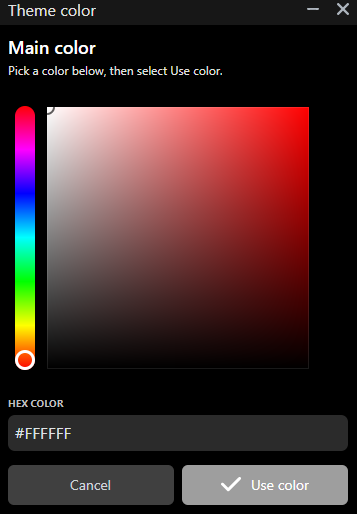

# BetterWheelWizard

<p align="center">
  <strong>A polished community launcher for Mario Kart Wii and Retro Rewind.</strong><br />
  Browse rooms, manage Miis, customize the launcher, and keep your game data backed up.
</p>

<p align="center">
  <a href="https://github.com/imlucaa/BetterWheelWizard/releases/latest">
    
  </a>
  <a href="https://github.com/imlucaa/BetterWheelWizard/releases">
    
  </a>
  <a href="LICENSE">
    
  </a>
</p>

<p align="center">
  <a href="https://github.com/imlucaa/BetterWheelWizard/releases/latest"><strong>Download</strong></a>
  ·
  <a href="#features"><strong>Features</strong></a>
  ·
  <a href="#requirements"><strong>Requirements</strong></a>
  ·
  <a href="CHANGELOG.md"><strong>Changelog</strong></a>
  ·
  <a href="https://github.com/imlucaa/BetterWheelWizard/issues/new"><strong>Report a bug</strong></a>
</p>

> [!IMPORTANT]
> BetterWheelWizard is an unofficial community fork of
> [TeamWheelWizard/WheelWizard](https://github.com/TeamWheelWizard/WheelWizard).
> It is not an official Team Wheel Wizard release.

## Download

Get the newest build from the
**[latest BetterWheelWizard release](https://github.com/imlucaa/BetterWheelWizard/releases/latest)**.

| Platform | Release file |
| --- | --- |
| Windows x64 | `BetterWheelWizardWindows.exe` |
| Linux x64 | `BetterWheelWizard_Linux` |
| Linux ARM64 | `BetterWheelWizard_ARM64_Linux` |

> [!NOTE]
> macOS packages are currently unavailable because signed builds could not be
> produced. Windows and Linux builds are available normally.

## Features

### Play and manage

- Launch Retro Rewind through Dolphin or use WiiCompiled
- Browse live rooms with player search, average-VR filters, sorting, race
  status, and detailed player information
- Find public Miis through RWFC friend-code lookup and import them directly
- Search, import, copy, and manage saved Miis

### Make it yours

- Choose from a larger collection of built-in color themes or save your own
- Customize main, wheel/title, text, and background colors with a visual picker or editable HEX fields
- Import and share compact `BWW1` theme codes
- Use the full color range while automatic contrast adjustments keep text readable

### Protect your data

- Back up every detected regional `rksys.dat` save while preserving folders
  such as `RMCE` and `RMCP`
- Back up `RRRating.pul` independently to a destination you choose
- Copy files directly without changing the originals or creating ZIP archives

## Feature showcase

### Theme library and sharing

Build a launcher style from four easy-to-understand color controls, choose
colors visually or paste exact HEX values, and save the result to your library.
Built-in presets cover basic rainbow colors and popular colors such as coral,
mint, lavender, and rose. You can also copy or paste a compact `BWW1` code to
share a complete theme.

<p align="center">
  <a href="docs/screenshots/better-themes.png">
    
  </a>
</p>

<p align="center">
  <a href="docs/screenshots/theme-color.png">
    
  </a>
</p>

### Mii Downloader

Look up an RWFC player by friend code or discover random public Miis, then
download a fresh copy directly into My Miis.

<p align="center">
  <a href="docs/screenshots/mii-downloader.png">
    
  </a>
</p>

### Better room browsing

Search rooms and players, filter by average VR, and sort live results from one
compact control panel. Room and player details stay readable at a glance.

<p align="center">
  <a href="docs/screenshots/better-rooms-2.5.10.png">
    
  </a>
</p>

<p align="center"><sub>Click a screenshot to open it at full resolution.</sub></p>

## Requirements

You must provide your own legally dumped Mario Kart Wii game backup.

Supported formats: `.iso`, `.gcm`, `.gcz`, `.ciso`, `.wbfs`, `.wia`, and
`.rvz`.

| Launch mode | Supported game region |
| --- | --- |
| Retro Rewind through Dolphin | Any region |
| WiiCompiled, with or without Retro Rewind | PAL |

## Build from source

BetterWheelWizard targets **.NET 10**. From the repository root:

```powershell
dotnet test WheelWizard.sln --configuration Release

dotnet publish WheelWizard/WheelWizard.csproj `
  --configuration Release `
  --runtime win-x64 `
  --self-contained true `
  -p:PublishSingleFile=true `
  -p:IncludeNativeLibrariesForSelfExtract=true `
  -p:EnableCompressionInSingleFile=true
```

Change `win-x64` to `linux-x64` or `linux-arm64` when publishing for Linux.

## Report a bug

[Open an issue](https://github.com/imlucaa/BetterWheelWizard/issues/new) and
include:

- What happened and what you expected instead
- Steps to reproduce the problem
- Your operating system and launch mode
- A screenshot or log, when available

## Credits

BetterWheelWizard is based on
[TeamWheelWizard/WheelWizard](https://github.com/TeamWheelWizard/WheelWizard),
created by [Patchzy](https://github.com/patchzyy) and
[WantToBeeMe](https://github.com/wanttobeeme).

- Retro Rewind was created by ZPL. See the
  [Tockdom Wiki](https://wiki.tockdom.com/wiki/Retro_Rewind).
- Parts of the Mii renderer were inspired by
  [ariankordi/FFL-Testing](https://github.com/ariankordi/FFL-Testing), based on
  [aboood40091/FFL-Testing](https://github.com/aboood40091/FFL-Testing).
- The wheel and flat-tire icons are by Delapouite from
  [Game Icons](https://game-icons.net/about.html).
- Special icons use Chadderz' Terrible Mario Kart Font.

## License

BetterWheelWizard is distributed under the
[GNU General Public License v3.0](LICENSE), matching the upstream project.
You may use, modify, and redistribute it under the terms of that license.
Derivative distributions must remain GPL v3.0 compatible and provide their
corresponding source code.
